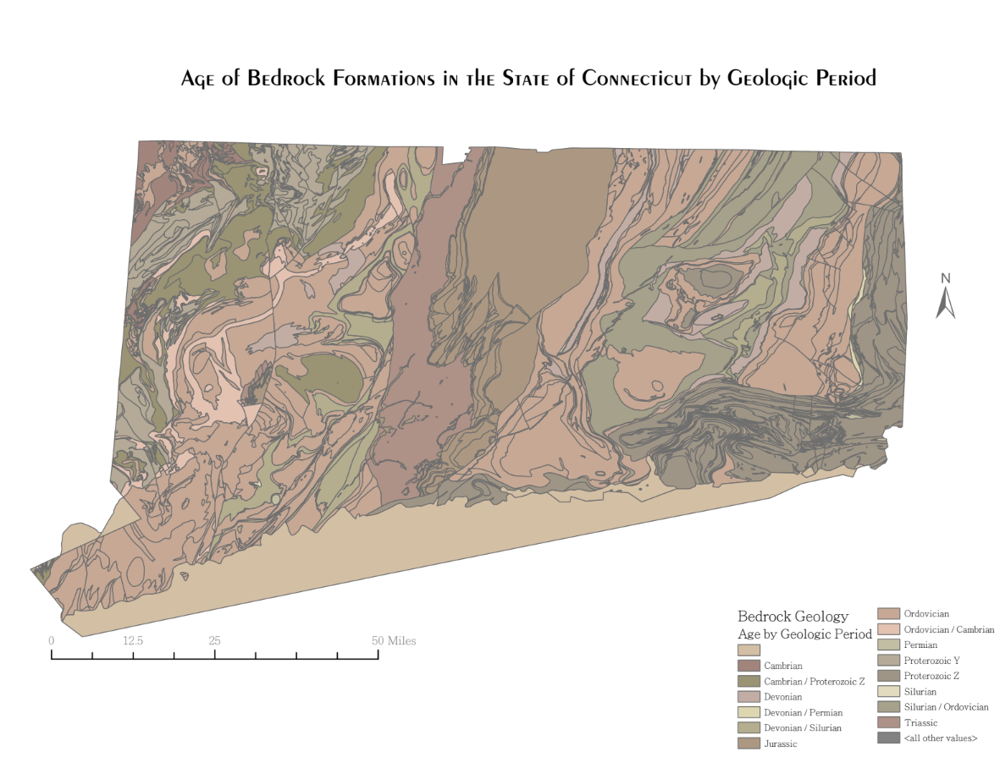
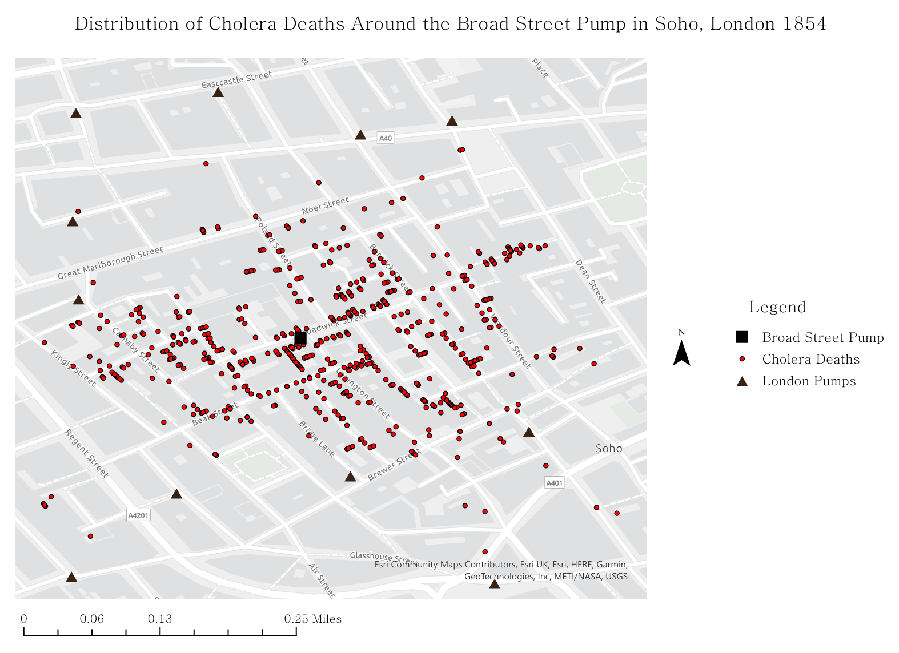

# Spatial Analysis Projects

This repository contains GIS and spatial analysis projects exploring environmental and geologic datasets. These projects demonstrate spatial data visualization, map design, and geospatial analysis workflows.

---

## Geologic Age of Bedrock Formations in the State of Connecticut

This project maps statewide bedrock geology of Connecticut using GIS workflows in QGIS. The map visualizes the spatial distribution of major bedrock units and their corresponding geologic ages. 

Key GIS techniques used in this project include raster mosaicking, coordinate reference system management, and custom layout design within QGIS.

Software: QGIS
Projection: NAD83 / Connecticut State Plane (ft)

Data Sources:

Connecticut Geological Survey – Bedrock Geology of Connecticut

[View Map](CT_Bedrock.pdf)

---

## Distribution of Cholera Deaths Around the Broad Street Pump in Soho, London 1854

This project maps the spatial distribution of cholera deaths in Soho, London, in 1854. By overlaying mortality data with public water pump locations, the map highlights clustering patterns that point to the Broad Street pump as the outbreak source.

This project demonstrates spatial pattern analysis, point data visualization, and multi-layer GIS integration.

Software: ArcGIS Pro 3.0

Data Sources: Historical cholera death records and pump locations from the 1854 Soho outbreak (commonly used in GIS spatial analysis exercises based on John Snow’s dataset).

[View Full Map](Broad_Street_Pump_Cholera_Distribution.png)
